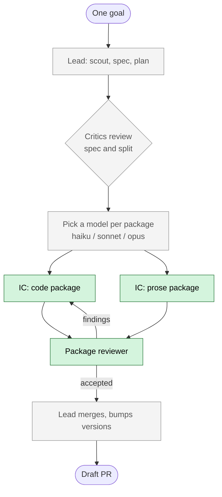

## Why

Today a session stops for me after brainstorming, after the spec, after the
plan, after the review. Each stop costs attention and the work waits. The
model is also picked before any investigation, so nearly everything runs on
Opus even when it did not need to.

`crew` is a project lead that removes both problems for one goal at a time.

## How it works

Green is what this PR builds. Grey comes in later stages.

A human plays the lead by hand for now, so each worker agent is proven
before the skill that dispatches them exists.

## What is here

- Three worker agents: `crew:ic`, `crew:ic-instructions`, `crew:package-reviewer`.
- Three shared references: the record format, the model-band rubric, and the
  contract injected into every IC.
- A self-contained writing standard (`writing-standard.md`) covering all four
  file types the instruction IC owns, read directly rather than loaded through
  another plugin's skill.
- No orchestrator. No hooks.

## What was tested

A live hand-driven run, kept as evidence in `docs/stage-2-run/`:

- A code package added real Tier 1 test coverage to `auto-approve`. The suite
  went from 199 to 203 passing, with 25 lines added and none removed.
- A prose package wrote `plugins/crew/README.md`.
- Both were reviewed by `crew:package-reviewer` and both reached
  `Verdict: accepted`.

**Not tested: the full path.** Separate worktrees per IC, per-package merges,
and the working-directory drift check never ran. A session that is itself
worktree-isolated cannot give a spawned agent write access to a sibling
worktree, and `--add-dir` does not lift that. Only the simple path ran end to
end. §15 of the design doc records this and eight other findings from the run
as open questions, not settled facts.

## Risk

**Read this one closely: `git commit` cannot be approved in a headless
dispatch.** The IC contract tells every IC to commit after each green step,
and in this dispatch shape that instruction cannot execute — the lead had to
commit for both ICs. Stage 4 must solve this before an autonomous loop is
built on top of it. See §15 items 11 and 12.

Smaller risks:

- An IC's own test file sits inside its declared file set, so it could delete
  an assertion to reach green. The contract forbids that, and the live run
  added lines and removed none. No failing assertion existed to weaken, so
  this shows compliance rather than a real test of the rule.
- Reference docs live under a stubbed skill directory so their paths do not
  move when stage 4 replaces the skill body.

## Deferred, not forgotten

1. Stage 5 ships `TeammateIdle` and `SessionEnd` together. The blocking half
   alone would let one crashed run block teammates in every later session.
2. Stage 4 must update `record-format.md`'s consumer table, since
   `crew:package-reviewer` now takes the whole package record entry.
3. The plan's `--plugin-dir` guidance was wrong: the flag takes one plugin
   directory, not a repo root. The fix also touched Task 1's verification
   step, which commit `d043378`'s message does not mention.
